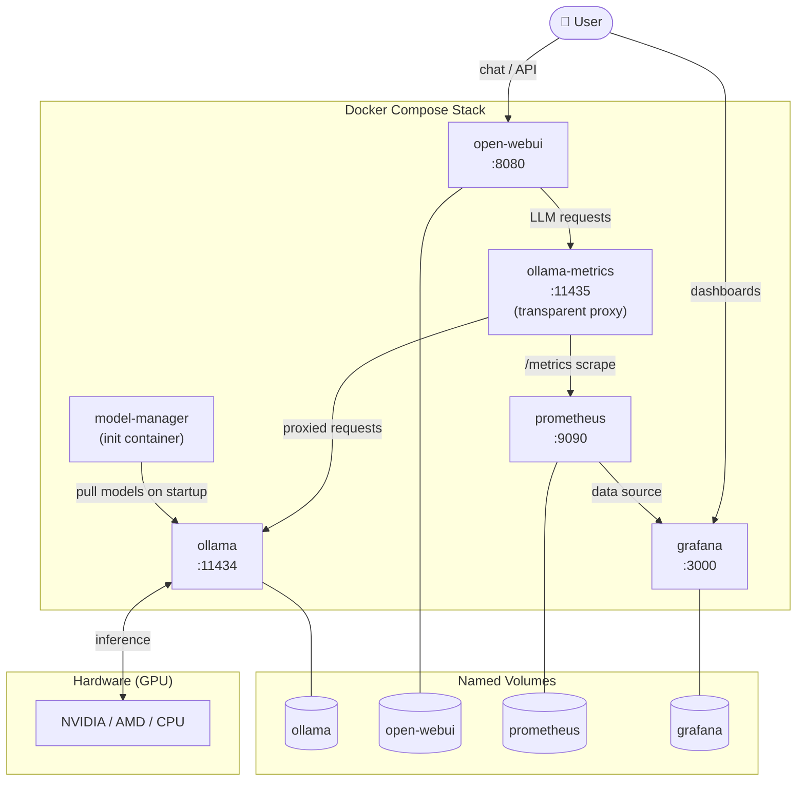

# ollama-deploy <!-- omit from toc -->

Deploy ollama locally using Docker

## Table of Contents <!-- omit from toc -->
- [Requirements](#requirements)
  - [Software Requirements](#software-requirements)
  - [Optional Requirements](#optional-requirements)
  - [Hardware](#hardware)
    - [NVIDIA](#nvidia)
    - [AMD](#amd)
- [Running](#running)
  - [CPU](#cpu)
  - [NVIDIA](#nvidia-1)
  - [AMD](#amd-1)
- [Endpoints](#endpoints)
- [Monitoring](#monitoring)
  - [Grafana](#grafana)
- [Architecture](#architecture)

## Requirements

### Software Requirements

1. `docker`
2. `docker-compose`
3. `nvidia` drivers (optional)
4. `nvidia-container-toolkit` (optional)

**Run the following to check for missing requirements:**
```
docker --version
docker compose version
nvidia-smi
nvidia-ctk --version
```

### Optional Requirements

1. `curl` - for downloads
2. `git` - for repo management
3. `jq` - for JSON parsing in scripts
4. `htop` / `nvtop` - for monitoring (nvtop shows GPU usage nicely)

### Hardware

This homelab was done on the following systems

#### NVIDIA
```
OS: Fedora Linux 42 (Workstation Edition) x86_64
CPU: AMD Ryzen 7 3700X (16) @ 4.43 GHz
GPU: NVIDIA GeForce RTX 2070 SUPER [Discrete]
Memory: 16 GiB
Swap: 8.00 GiB
```

#### AMD
```
OS: Fedora Linux 43 (Workstation Edition) x86_64
CPU: AMD Ryzen AI 9 365 (20) @ 2.00 GHz
GPU: AMD Radeon 880M Graphics [Integrated]
Memory: 24 GiB
Swap: 8 GiB
```
## Running

### CPU
```
docker compose -f compose.yml -f compose.cpu.yml --env-file ./env/dev/.env up
```

### NVIDIA
```
docker compose -f compose.yml -f compose.nvidia.yml --env-file ./env/dev/.env up
```

### AMD
```
docker compose -f compose.yml -f compose.amd.yml --env-file ./env/dev/.env up
```

## Endpoints

| Service        | URL                    | Description                                   |
| -------------- | ---------------------- | --------------------------------------------- |
| Open WebUI     | http://localhost:8080  | Chat interface for interacting with models    |
| Ollama API     | http://localhost:11434 | Ollama REST API                               |
| ollama-metrics | http://localhost:11435 | Proxied Ollama API + `/metrics` endpoint      |
| Prometheus     | http://localhost:9090  | Metrics storage and query UI                  |
| Grafana        | http://localhost:3000  | Dashboards (default login: `admin` / `admin`) |


## Monitoring

Ollama does not expose a native Prometheus metrics endpoint, so this setup uses [ollama-metrics](https://github.com/NorskHelsenett/ollama-metrics) as a transparent HTTP proxy in front of Ollama. All client requests (e.g. from open-webui) are routed through it, allowing it to instrument every request and expose the data at a `/metrics` endpoint for Prometheus to scrape.

### Grafana

Grafana is available at http://localhost:3000 (default credentials: `admin` / `admin`).

A pre-built **Ollama Overview** dashboard is provisioned automatically on startup — no manual import needed. It includes the following panels:

| Panel                                | Description                                                 |
| ------------------------------------ | ----------------------------------------------------------- |
| Request Rate                         | Requests per second hitting the Ollama API                  |
| Request Duration                     | Overall latency distribution across all requests            |
| Request Duration p95 (by Model)      | 95th-percentile latency broken down per model               |
| Token Generation Time p95 (by Model) | How long generation takes at the 95th percentile, per model |
| Token Generation Rate (by Model)     | Tokens generated per second, per model                      |
| Generated Tokens by Model            | Total completion tokens over time, per model                |
| Prompt Tokens by Model               | Total prompt tokens over time, per model                    |
| Token Prompt Rate (by Model)         | Prompt tokens processed per second, per model               |
| Average Time per Token by Model      | Mean milliseconds per generated token, per model            |


## Architecture

