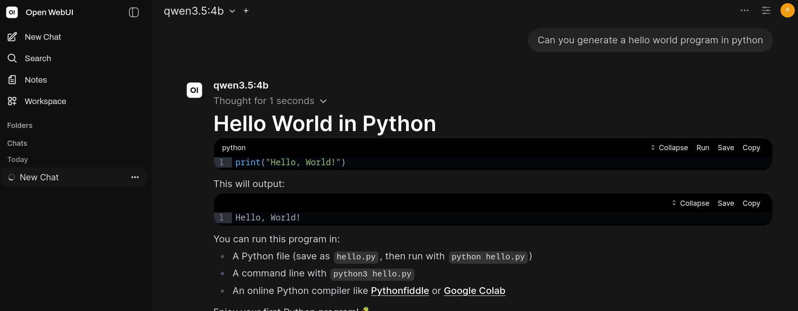
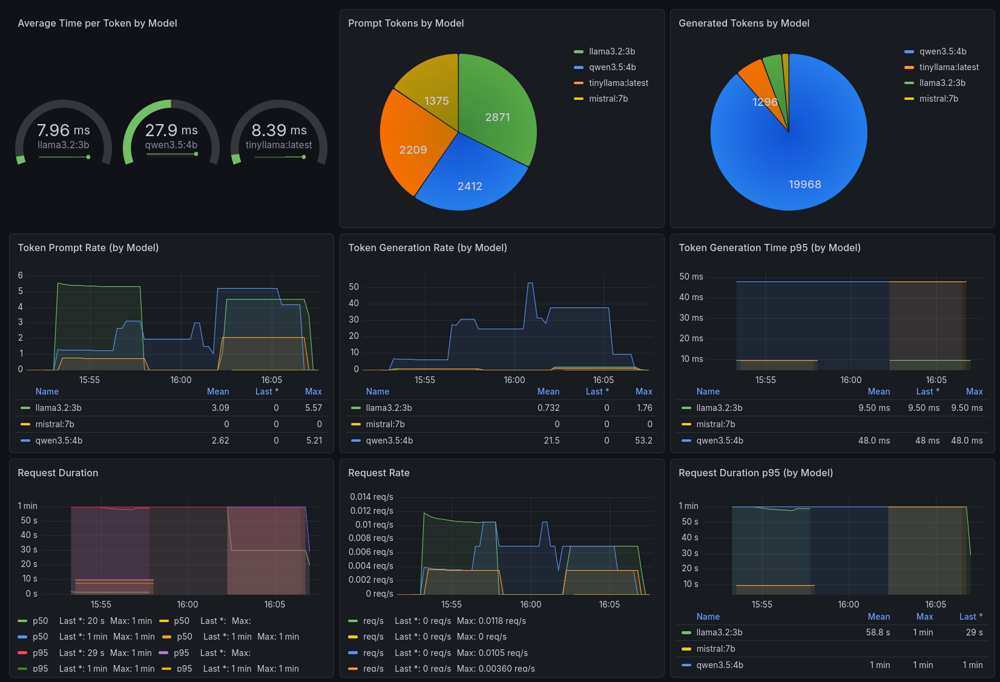

# ollama-deploy <!-- omit from toc -->

A Docker Compose setup for running [Ollama](https://ollama.com) locally with the following support stack: 

1. [Open WebUI](https://github.com/open-webui/open-webui)
2. [ollama-metrics](https://github.com/NorskHelsenett/ollama-metrics)
3. [Prometheus](https://github.com/prometheus/prometheus)
4. [Grafana](https://github.com/grafana/grafana)

## Table of Contents <!-- omit from toc -->
- [Architecture](#architecture)
- [Prerequisites](#prerequisites)
- [Configuration](#configuration)
  - [Models](#models)
  - [Ports and credentials](#ports-and-credentials)
- [Running](#running)
- [Endpoints](#endpoints)
- [Open WebUI](#open-webui)
- [Monitoring](#monitoring)
  - [How it works](#how-it-works)
  - [Grafana dashboard](#grafana-dashboard)
- [Tested hardware](#tested-hardware)
    - [NVIDIA](#nvidia)
    - [AMD](#amd)

## Architecture

| Service            | Role                                                                         |
| ------------------ | ---------------------------------------------------------------------------- |
| **ollama**         | Runs the LLM inference engine and exposes the Ollama API                     |
| **model-manager**  | Init container that syncs the model list on startup then exits               |
| **ollama-metrics** | Transparent HTTP proxy in front of Ollama; exposes `/metrics` for Prometheus |
| **open-webui**     | Web-based chat interface; routes all requests through ollama-metrics         |
| **prometheus**     | Scrapes metrics from ollama-metrics every 15 s                               |
| **grafana**        | Visualizes Prometheus data; ships with a pre-built Ollama dashboard          |


## Prerequisites

| Tool                                                                                                               | Required | Purpose                                        |
| ------------------------------------------------------------------------------------------------------------------ | -------- | ---------------------------------------------- |
| [`docker`](https://docs.docker.com/get-docker/)                                                                    | Yes      | Container runtime                              |
| [`docker compose`](https://docs.docker.com/compose/install/) v2+                                                   | Yes      | Multi-container orchestration                  |
| [`nvidia-container-toolkit`](https://docs.nvidia.com/datacenter/cloud-native/container-toolkit/install-guide.html) | No       | NVIDIA GPU passthrough                         |
| `curl`                                                                                                             | No       | Downloading models or testing the API manually |
| `jq`                                                                                                               | No       | Parsing JSON output from the Ollama API        |
| `htop` / `nvtop`                                                                                                   | No       | System and GPU usage monitoring                |

Verify your installation:
```sh
docker --version
docker compose version
nvidia-smi          # NVIDIA only
nvidia-ctk --version  # NVIDIA only
```

## Configuration

All configuration lives in `env/dev/.env`. Copy and edit it before running.

### Models

The `OLLAMA_MODELS` variable is a comma-separated list of models to pull. The **model-manager** init container runs on every startup and keeps the local model store in sync with this list — it pulls anything missing and removes anything no longer listed.

```sh
# env/dev/.env
OLLAMA_MODELS="llama3.2:3b,qwen3.5:4b,gemma3:4b,mistral:7b,tinyllama:latest"
```

Browse available models at [ollama.com/library](https://ollama.com/library).

### Ports and credentials

All host-side ports and the Grafana admin password are configurable in the same file:

| Variable                     | Default | Description                              |
| ---------------------------- | ------- | ---------------------------------------- |
| `OLLAMA_HOST_PORT`           | `11434` | Ollama API                               |
| `OLLAMA_METRICS_HOST_PORT`   | `11435` | ollama-metrics proxy                     |
| `OPEN_WEBUI_HOST_PORT`       | `8080`  | Open WebUI                               |
| `PROMETHEUS_HOST_PORT`       | `9090`  | Prometheus                               |
| `GF_HOST_PORT`               | `3000`  | Grafana                                  |
| `GF_SECURITY_ADMIN_PASSWORD` | `admin` | Grafana admin password — **change this** |

## Running

Choose the compose override that matches your hardware. The base `compose.yml` is always included.

**CPU**

```sh
docker compose -f compose.yml -f compose.cpu.yml --env-file ./env/dev/.env up
```

**NVIDIA**

Requires `nvidia-container-toolkit`. See [NVIDIA's installation guide](https://docs.nvidia.com/datacenter/cloud-native/container-toolkit/install-guide.html).

```sh
docker compose -f compose.yml -f compose.nvidia.yml --env-file ./env/dev/.env up
```

**AMD**

Uses the `ollama:rocm` image for ROCm-based GPU acceleration.

```sh
docker compose -f compose.yml -f compose.amd.yml --env-file ./env/dev/.env up
```

## Endpoints

Once the stack is up, the following are available on localhost:

| Service        | URL                    | Description                                   |
| -------------- | ---------------------- | --------------------------------------------- |
| Open WebUI     | http://localhost:8080  | Chat interface for interacting with models    |
| Ollama API     | http://localhost:11434 | Ollama REST API                               |
| ollama-metrics | http://localhost:11435 | Proxied Ollama API + `/metrics` endpoint      |
| Prometheus     | http://localhost:9090  | Metrics storage and query UI                  |
| Grafana        | http://localhost:3000  | Dashboards (default login: `admin` / `admin`) |

## Open WebUI

[Open WebUI](https://github.com/open-webui/open-webui) is a self-hosted chat interface that connects to Ollama. It provides a ChatGPT-style experience for running and switching between local models, with support for conversation history, system prompts, and multi-model comparisons.

Available at http://localhost:8080. On first launch you will be prompted to create an admin account.

All requests from Open WebUI are routed through ollama-metrics so that every interaction is captured in the monitoring stack.

Key features:
- Select and switch between any model pulled by model-manager
- Persistent conversation history stored in a local Docker volume
- System prompt and parameter controls per conversation
- Supports multiple users with individual accounts



## Monitoring

### How it works

Ollama does not expose a native Prometheus metrics endpoint. This setup uses [ollama-metrics](https://github.com/NorskHelsenett/ollama-metrics) as a transparent HTTP proxy that sits between Open WebUI and Ollama. Every request passes through it unchanged, but ollama-metrics instruments each one and exposes the aggregated data at `/metrics` for Prometheus to scrape every 15 seconds.

### Grafana dashboard

A pre-built **Ollama Overview** dashboard is provisioned automatically on startup via Grafana's file-based provisioning — no manual import or setup needed. It is available immediately at [http://localhost:3000](http://localhost:3000/d/ollama-overview/ollama-overview).



## Tested hardware

This setup has been validated on the following machines:

#### NVIDIA
```
OS: Fedora Linux 42 (Workstation Edition) x86_64
CPU: AMD Ryzen 7 3700X (16) @ 4.43 GHz
GPU: NVIDIA GeForce RTX 2070 SUPER [Discrete]
Memory: 16 GiB
Swap: 8.00 GiB
```

#### AMD
```
OS: Fedora Linux 43 (Workstation Edition) x86_64
CPU: AMD Ryzen AI 9 365 (20) @ 2.00 GHz
GPU: AMD Radeon 880M Graphics [Integrated]
Memory: 24 GiB
Swap: 8 GiB
```
